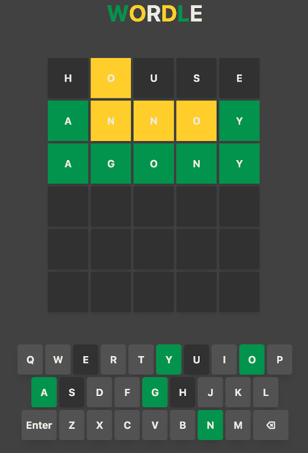

# Wordle

This is a clone of the wordle game found at nytimes.com/games/wordle that I created to practice using React and Tailwind.

Includes homemade responsive GUI keyboard, CSS animations and responsive design (in progress).

To see it in action:

``` shell
git clone https://github.com/ethan-fraser/wordle.git
cd wordle
npm install
npm run start
# open localhost:3000
```

### Preview

